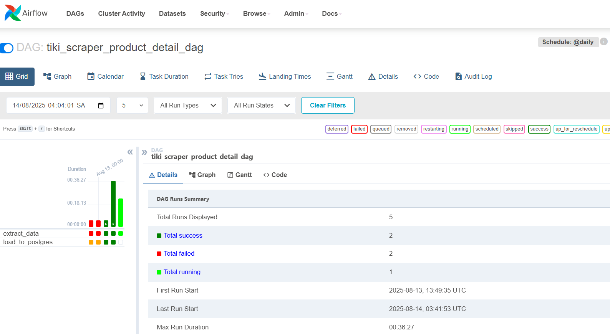
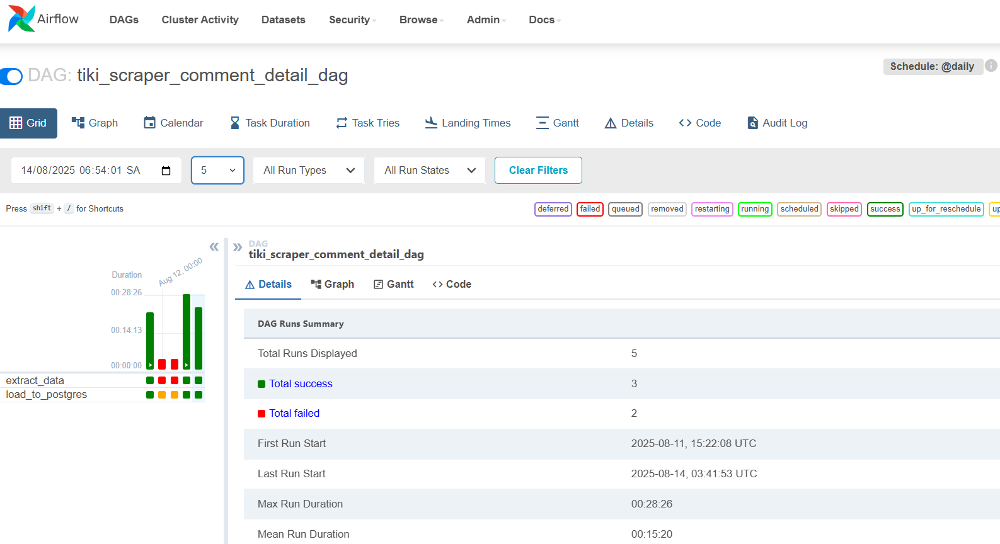

# Phân Tích Dữ Liệu Sách trên Sàn Thương Mại Điện Tử Tiki

## 1. Giới Thiệu Dự Án

Đây là một dự án kỹ thuật dữ liệu (Data Engineering) hoàn chỉnh nhằm thu thập, xử lý, lưu trữ và trực quan hóa dữ liệu về các sản phẩm sách được bán trên sàn thương mại điện tử Tiki.vn.

Mục tiêu của dự án là xây dựng một hệ thống tự động để theo dõi và phân tích các chỉ số kinh doanh quan trọng như: số lượng sản phẩm, tổng số đơn hàng đã bán, doanh thu, giá trung bình, và số lượng đánh giá. Các thông tin này sau đó được tổng hợp và hiển thị trên một dashboard Power BI tương tác, giúp người dùng dễ dàng nắm bắt và đưa ra quyết định.

**Run DAG via Airflow:**







**Dashboard Power BI Demo:**


## 2. Các Công Nghệ Sử Dụng

- **Thu thập dữ liệu (Scraping):** Python (sử dụng thư viện `requests`, `pandas`) để gọi đến API ẩn của Tiki.
- **Điều phối tác vụ (Orchestration):** Apache Airflow để lên lịch và tự động hóa quy trình cào dữ liệu hàng ngày.
- **Cơ sở dữ liệu (Database):** PostgreSQL để lưu trữ dữ liệu thô và dữ liệu đã qua xử lý.
- **Trực quan hóa (Visualization):** Microsoft Power BI để xây dựng báo cáo và dashboard phân tích.
- **Containerization:** Docker và Docker Compose để đóng gói và triển khai toàn bộ ứng dụng một cách dễ dàng và nhất quán.

## 3. Luồng Dữ Liệu và Kiến Trúc Hệ Thống

Dự án hoạt động theo một quy trình khép kín, tự động hóa cao từ khâu thu thập đến lúc hiển thị dữ liệu.

### Sơ đồ Luồng Dữ Liệu (Data Flow)


### Sơ đồ Kiến Trúc Hạ Tầng (Infrastructure)

Toàn bộ hệ thống được đóng gói trong các container Docker, giúp việc cài đặt và vận hành trở nên đơn giản.


## 4. Hướng Dẫn Cài Đặt và Triển Khai

### Yêu cầu:
- [Docker](https://www.docker.com/products/docker-desktop/) được cài đặt trên máy của bạn.
- [Power BI Desktop](https://powerbi.microsoft.com/en-us/desktop/) (nếu muốn xem và chỉnh sửa báo cáo).

### Các bước thực hiện:

**Bước 1: Sao chép (Clone) Repository**
```bash
git clone https://github.com/RobertPhamDA/Official_Scrape_Tiki_Data.git
cd Official_Scrape_Tiki_Data
```

**Bước 2: Cấu hình Biến Môi Trường**

Tạo một file tên là `.env` bằng cách sao chép từ file `.env.example`.
```bash
cp .env.example .env
```
Mở file `.env` và tùy chỉnh các giá trị (nếu cần). Các giá trị mặc định đã được thiết lập sẵn để dự án có thể chạy ngay lập tức.

**Bước 3: Khởi chạy hệ thống với Docker Compose**

Mở terminal và chạy lệnh sau. Lệnh này sẽ xây dựng (build) các image cần thiết và khởi tạo các container cho Airflow và PostgreSQL.
```bash
docker-compose up -d
```

Quá trình này có thể mất vài phút trong lần chạy đầu tiên.

**Bước 4: Truy cập Airflow UI**

1.  Mở trình duyệt và truy cập vào địa chỉ: `http://localhost:8080`
2.  Đăng nhập với tài khoản mặc định:
    -   **Username:** `airflow`
    -   **Password:** `airflow`
3.  Trên giao diện Airflow, tìm DAG có tên `tiki_data_pipeline` và kích hoạt nó (Un-pause) để bắt đầu chạy quy trình cào dữ liệu đầu tiên.

**Bước 5: Kết nối Power BI tới PostgreSQL**

1.  Mở file Power BI có trong thư mục của dự án.
2.  Power BI có thể sẽ yêu cầu thông tin kết nối tới cơ sở dữ liệu. Cung cấp các thông tin sau:
    -   **Server:** `localhost`
    -   **Database:** `tiki_data` (hoặc tên database bạn đã cấu hình trong file `.env`)
    -   **Username:** `airflow` (hoặc username bạn đã cấu hình)
    -   **Password:** `airflow` (hoặc password bạn đã cấu hình)
3.  Sau khi kết nối thành công, nhấn "Refresh" để tải dữ liệu mới nhất từ database về và xem báo cáo.

## 5. Cấu Trúc Thư Mục

```
.
├── dags/                  # Chứa các file định nghĩa DAG của Airflow
│   └── tiki_main_dag.py
├── images/                # Chứa hình ảnh cho file README
├── scripts/               # Chứa các script Python thực thi việc cào và xử lý dữ liệu
│   └── tiki_scraper.py
├── Views For Power BI/    # Chứa các file SQL định nghĩa Views cho Power BI
├── .env                   # File cấu hình biến môi trường (cần tự tạo)
├── .env.example           # File mẫu cho biến môi trường
├── .gitignore             # Các file và thư mục được Git bỏ qua
├── docker-compose.yml     # File định nghĩa kiến trúc và dịch vụ của Docker
└── README.md              # File mô tả dự án
```